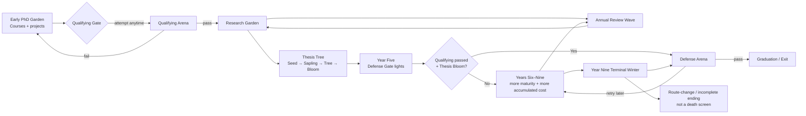
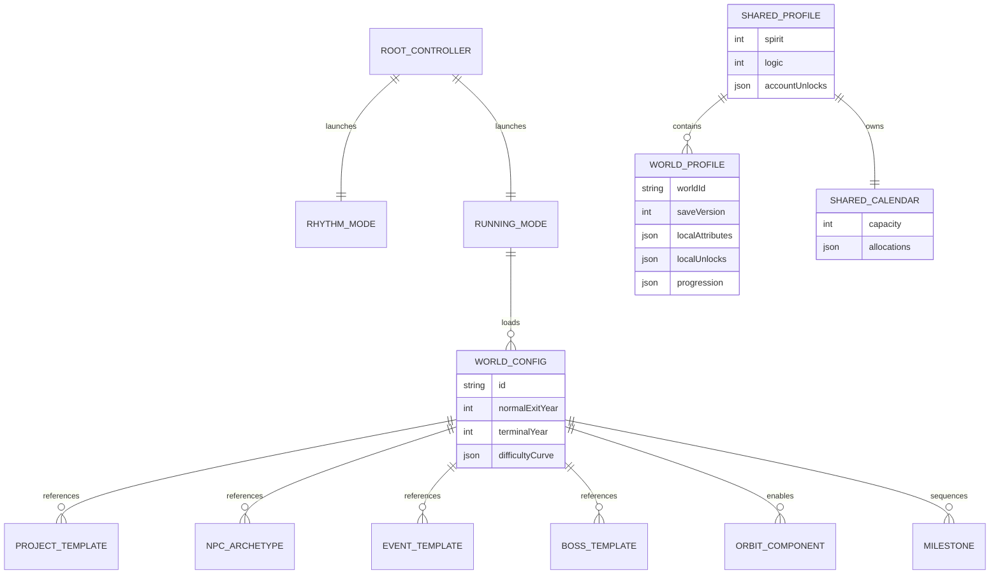

# BeatGarden Running Mode Research and Implementation Blueprint

## Executive summary

BeatGarden has a credible path to becoming a **two-mode product rather than a rhythm game with an attached mini-game**:

**BeatGarden → Rhythm Mode + Running Mode**

The existing repository is already a TypeScript/Vite/Vitest web/PWA project with four rhythm stages, local AutoChart, calibration/settings, a service worker, GitHub Pages deployment, and a deliberately strict asset-provenance policy. Phaser is not currently installed, so Running Mode should be added as a **parallel subsystem**, not used as an excuse to rewrite Rhythm Mode. fileciteturn2file0L2-L2 fileciteturn6file0L2-L2

The strongest product thesis from the research is:

> **Running Mode should work first as an expressive, low-text survivor roguelite; the academic/work satire should be a second layer of meaning.**

That conclusion is reinforced by the reference set. *Vampire Survivors*, *Brotato*, *20 Minutes Till Dawn* and *Deep Rock Galactic: Survivor* all reduce moment-to-moment cognitive load enough that players can focus on positioning and build decisions; *Rhythm Doctor* demonstrates that fairly sophisticated concepts can be taught almost invisibly through a highly legible interaction language; *Crypt of the NecroDancer*, *BPM* and *Hi-Fi RUSH* show several ways to make periodicity itself part of the gameplay without requiring the entire product to become a conventional lane-based rhythm game. citeturn13search7turn14search1turn13search0turn13search1 citeturn14search0turn14search10turn14search13turn15search3

The major differentiator should therefore **not** be “Vampire Survivors but graduate-school jokes.” It should be the interaction of five original systems:

**Portfolio Orbit / 成果环** gives the immediate bullet-heaven spectacle; **Signal / Noise** separates useful expertise from harmful behavior; **Calendar** turns time and overcommitment into a real strategic resource; **Garden / Project growth** makes long-term work physically visible; **Milestone Gates** turn major life transitions into special encounters while recurring bureaucracy remains part of the continuous world.

The evidence base strongly supports that separation of benefits and harms. Job Demands–Resources theory explicitly distinguishes energy-consuming demands from resources that help accomplish goals, stimulate growth and buffer demands; Self-Determination Theory separately identifies autonomy, competence and relatedness as important psychological needs. That means a technically outstanding but emotionally harmful mentor can legitimately produce **high Signal and high Noise simultaneously**, whereas a kind but poorly matched mentor can be low-Noise without being high-Signal. The game should never encode “abuse makes you stronger”; expertise generates Skill/Insight, while harmful behavior independently generates costs. citeturn17search1turn17search9turn17search2

The online evidence also supports the concrete pressure archetypes already conceived. Official workplace guidance lists constant criticism, public put-downs and deliberately heavier workloads as examples of bullying; WHO identifies excessive workload, long or inflexible hours, low control, authoritarian supervision, bullying, unclear roles and work–home conflict as psychosocial hazards. Academic surveys and studies additionally describe career interference, credit-taking, funding threats, hostile supervision and inadequate supervision. Chinese Ministry of Education material explicitly discusses inadequate supervisory effort/methods and reports concerns about supervisors assigning students private work; separate Chinese reporting illustrates recurrent authorship disputes. citeturn16search5turn17search0turn16search10turn18search0turn18search5turn18search2

Reddit and similar anonymous posts add useful *texture*, not prevalence estimates: recent examples include late-night vague criticism, mandatory or shifting work hours, last-minute meetings, weekend expectations, changing requirements after work is completed, and out-of-hours calls. Those should be treated as an anecdotal inspiration bank only. citeturn20search5turn20search13turn20search15turn19search10

For the PhD vertical slice, the recommended progression is intentionally sparse:

**continuous Garden → optional-timing Qualifying → continuous Research Garden + Annual Reviews → Thesis Tree → Year-five Defense Gate → Defense → exit; Years six through nine are an optional extension window with simultaneously greater maturity and greater accumulated cost.**

Only **Qualifying and Defense** need dedicated special arenas in the MVP. Annual Review is a recurring meeting wave, and Thesis is a persistent environmental object, not another menu or level. This preserves the core rule already established in the design work: *repeatable life events become systems; true identity transitions become gates.*

The Cultivation map is strategically important even though it comes later. It tests whether Running Mode is genuinely a game system rather than a collection of academia jokes. Cultivation can reuse Calendar, Signal/Noise, Portfolio Orbit, periodic meetings and milestones while replacing the literal context with sect assemblies, scriptures, alchemy, formations, inner demons and tribulations. Only **Spirit and Logic** should cross back into the shared account; Qi, Realm, spiritual roots, divine sense, formations, alchemy and other cultivation progression remain local to Cultivation.

There is one material brand issue to address before commercial release. An active **BeatGarden Studios** in Barcelona currently uses “BeatGarden” for recording, mixing and music-production services. That does **not** establish that the game name is unavailable or infringing, but because BeatGarden includes a music-focused Rhythm Mode, the adjacency is closer than an unrelated use would be. USPTO guidance recommends comprehensive searches covering similar marks, related goods/services and common-law use. A formal US/Japan/EU/WIPO clearance should therefore be a release gate, although it need not block prototyping. citeturn23search2turn23search5turn21search1turn21search2

The existing repository’s procedural-asset policy is unusually useful here: v1 currently records zero imported third-party binary creative assets and requires source URL, author, license, commit SHA and attribution details if that changes. Keeping this policy during the vertical slice substantially reduces IP risk. fileciteturn11file0L2-L2

**Recommended development decision:** implement only the PhD vertical slice first, but construct its configuration schema so Master, Work and Cultivation are data packs over the same engine. Do not build all four maps until a no-text playtest proves that simply moving, dodging, collecting, growing a Portfolio Orbit, surviving meeting waves and reaching the next gate is enjoyable without understanding a single academic joke.

## Competitive landscape and evidence base

The comparison below deliberately focuses on **principles worth studying**, not assets, characters, exact UI arrangements, upgrade names or distinctive audiovisual expression. The US Copyright Office notes that the idea for a game and methods of play are not protected by copyright, while sufficiently expressive art/text can be; that is a useful boundary for competitive research, although trademark, trade-dress and other rights remain separate issues. citeturn21search7

For platform consistency, “PC/Steam” below means the platform directly verified in this research from the current storefront; it is not intended as an exhaustive list of every console/mobile port.

| Title | Platform | Core loop | Monetization | Mechanic principle worth studying | Art style | Imitation / brand risk |
|---|---|---|---|---|---|---|
| **Vampire Survivors** citeturn13search7turn13search13 | PC/Steam | Move, survive escalating hordes, collect XP, snowball weapons/passives | Premium; additional DLC exists | Extreme **power-growth readability**; low-input combat; pickups remain legible amid large crowds; touch support | Retro 2D/pixel gothic | **Medium.** Generic auto-attack/survival principles are safe territory; do not reproduce its weapon evolutions, UI, fonts, sprites, stage layouts or presentation |
| **Brotato** citeturn14search1turn14search2 | PC/macOS/Linux via Steam | Short 20–90-second waves, auto-fire, collect materials, shop/build between waves | Premium; additional content/bundles | Excellent reference for **short cadence**, build economy and explicit difficulty assists; supports enemy health/damage/speed tuning | Minimal, comic/cartoon arena | **Medium-high visually.** A small central avatar surrounded by a fixed six-weapon arrangement is distinctive enough that BeatGarden’s Orbit should have a clearly different visual grammar |
| **20 Minutes Till Dawn** citeturn13search0turn13search11 | PC/Steam; macOS requirements shown | 10–20-minute runs, directional shooting, XP upgrades, bosses and meta-runes | Premium | Keep runs short; make **50+ upgrades** produce recognizable build identities; active aiming shows a possible optional skill layer | Limited-palette pixel horror | **Low-medium.** Borrow build-tree principles, not its horror silhouettes, rune terminology or weapon identities |
| **Deep Rock Galactic: Survivor** citeturn13search1turn13search4 | PC/Steam | Auto-shoot, move/mine, complete objectives, extract, progress deeper | Premium; DLC available | Most relevant structural lesson: **survivor combat plus spatial mission objectives** rather than pure timer survival | Stylized top-down science-fiction | **High brand risk if copied literally** because it is an adaptation of an established IP. Borrow objective integration, not mining identity, dwarves, terminology or visual language |
| **HoloCure: Save the Fans!** citeturn15search0turn15search2 | PC/Steam | Survivor-like combat, character-specific kits, builds and large unlock pool | Free unofficial fan game | Strong reference for character/build differentiation and playful side systems | Colorful pixel/anime | **High.** Its business/legal context depends on fan-IP circumstances that BeatGarden should not imitate; avoid all franchise-specific references |
| **Crypt of the NecroDancer** citeturn14search10 | PC/macOS/Linux via Steam | Move and attack on musical beats through procedural dungeons; loot/meta unlocks | Premium | Rhythm can govern **world cadence and enemy behavior**, not merely score timing; good inspiration for meeting waves as predictable temporal grammar | Pixel dungeon with strong musical animation | **Medium.** Do not make Running movement itself “NecroDancer-like”; use periodicity at a higher system level |
| **Rhythm Doctor** citeturn14search0turn14search6 | PC/Steam | Mostly one-button timing; each level teaches a new rhythmic concept through audiovisual transformation | Premium | Critical lesson for BeatGarden: **teach complexity without requiring vocabulary**; preserve one clear input rule while visuals communicate changing systems | Expressive 2D/pixel/flat medical scenes | **Medium-high.** The one-button medical-defibrillation motif is distinctive; borrow teaching philosophy, not interaction fiction |
| **BPM: Bullets Per Minute** citeturn14search13turn14search17 | PC/Steam | Shoot, jump and dodge to the beat through randomized dungeons; loot and bosses | Premium | Boss behavior can be **rhythmically legible** and procedural combat can coexist with strong beat expectations | Highly stylized high-contrast 3D FPS | **Medium.** Avoid its audiovisual filter, music identity and beat-shooter presentation |
| **Hi‑Fi RUSH** citeturn15search3turn15search15 | PC/Steam | Character-action combat in a world where environment/combat sync to music | Premium; cosmetic/additional content exists | Important integration lesson: the **world can pulse rhythmically while basic movement remains forgiving**; its BPM Rush also demonstrates escalating temporal pressure | Cel-shaded/comic animation | **High visual risk.** Do not imitate comic framing, character silhouettes, UI or world art |
| **A Dance of Fire and Ice** citeturn15search4turn15search18 | PC/macOS/Linux via Steam | One-input rhythm traversal; winding path previews timing before it happens | Premium | **Pre-telegraph difficulty visually**; calibration and sight-reading are first-class | Abstract geometric, two orbiting planets | **Medium-high for the orbit motif.** BeatGarden’s Portfolio Orbit must read as a dynamic collection of accomplishments, not a two-body rhythm path |
| **Rift of the NecroDancer** citeturn15search17 | PC/Steam | Lane-based musical combat where enemies have distinct rhythmic behaviors | Premium | Strong precedent for **enemy silhouette = behavior**, plus four explicit difficulty intensities | Bright, animated lane-rhythm fantasy | **Medium.** Borrow readable behavior coding and difficulty structure, not lanes/monster patterns/UI |

The most useful overlap is not “copy the survivor formula.” It is the intersection of **low-input movement**, **dense combinatorial builds**, **clearly telegraphed periodic pressure**, **visible objective progress** and **difficulty that can be softened without changing the fantasy**. Brotato explicitly exposes enemy health, damage and speed assists; Rift provides four intensity levels; Rhythm Doctor repeatedly teaches new systems while keeping its central interaction understandable. That combination strongly supports BeatGarden’s “children should enjoy it even without reading” requirement. citeturn14search1turn15search17turn14search6


[Download the feature-overlap heatmap](sandbox:/mnt/data/beatgarden_competitor_heatmap.png)

The heatmap is an **author-coded qualitative comparison**, not a measured industry dataset: `0` means absent/minimal in the reference title, `1` partial, and `2` central. Its design implication is that BeatGarden should occupy the less-common combination of survivor-like automatic offense, milestone/objective play, low-text visual comprehension and periodic “life rhythm” without forcing Running Mode actions onto a musical beat. The source features underlying the coding come from the current storefront descriptions above. citeturn14search1turn13search0turn13search1turn14search10 citeturn14search6turn15search3turn15search18turn15search17

**Evidence hierarchy and what should actually drive mechanics**

The source hierarchy should be explicit because anonymous complaints are useful for jokes but weak evidence for prevalence.

| Priority | Source and link | What it supports | Design consequence |
|---|---|---|---|
| **A — theory** | [Bakker & Demerouti, Job Demands–Resources Theory, 2017](https://doi.org/10.1037/ocp0000056) citeturn17search1 | Jobs can be modeled in terms of demands and resources; resources can buffer demands and support engagement | Calendar/Energy costs and Skill/Connection/Purpose resources should coexist rather than collapse into a “good/bad job” meter |
| **A — theory** | [Ryan & Deci, Self-Determination Theory, 2000](https://doi.org/10.1037/0003-066X.55.1.68) citeturn17search2 | Autonomy, competence and relatedness are central psychological needs in SDT | Purpose/agency, Skill/competence and Connection should be mechanically distinct |
| **A — official occupational-health guidance** | [WHO — Mental health at work](https://www.who.int/news-room/fact-sheets/detail/mental-health-at-work) citeturn17search0 | Excess workload, long/inflexible hours, low control, poor support, authoritarian supervision, bullying, unclear roles and work–home conflict are psychosocial risks | Calendar overload, Midnight Bell, low-autonomy events, ambiguity and isolation are grounded themes |
| **A — official global report** | [ILO — Experiences of violence and harassment at work](https://www.ilo.org/publications/major-publications/experiences-violence-and-harassment-work-global-first-survey) citeturn17search4turn17search18 | Global exploratory survey covering psychological, physical and sexual violence/harassment and barriers to disclosure | Supports Work-map emphasis on power, reporting risk and psychological harassment, while avoiding claims about a specific company |
| **A — official practice guidance** | [Acas — Bullying at work](https://www.acas.org.uk/bullying-at-work) citeturn16search5 | Examples include constant criticism, meeting put-downs and intentionally heavier workload | Meeting Noise, workload swarms and public-criticism mechanics |
| **A — important counterbalance** | [Acas — considering whether conduct is bullying](https://www.acas.org.uk/bullying-at-work/if-you-think-youre-being-bullied) citeturn16search22 | Appropriate private performance correction is not automatically bullying; even over-checking can arise without intent | **Signal/Noise is mandatory:** tough feedback can be valuable, and intent/competence/impact must remain separable |
| **A — Chinese official guidance** | [PRC Ministry of Education — Graduate Supervisor Guidance Code](https://www.moe.gov.cn/srcsite/A22/s7065/202011/t20201111_499442.html) citeturn18search5 | Formal supervisory-behavior requirements; related ministry material acknowledged inadequate investment/methods and concerns such as private errands | Supports private-errand, insufficient-guidance and boundary mechanics without using any real individual |
| **B — empirical academic study** | [STEM the bullying: abusive supervision in academic science](https://pmc.ncbi.nlm.nih.gov/articles/PMC8433114/) citeturn16search10 | The survey’s definition includes ridicule, threats, blaming, public put-downs, privacy intrusion, funding/career interference, credit-taking and fellowship/visa threats | Strong source for Boss pattern taxonomy; do **not** turn its sample rate into a universal prevalence claim |
| **B — large contemporary doctoral survey** | [Nature 2025 global PhD survey](https://www.nature.com/articles/d41586-025-03149-7) citeturn16search4turn16search14 | 3,785 doctoral respondents; inadequate supervision and harassment remained significant concerns | Ghost Supervisor and supportive-supervision mechanics belong alongside overtly hostile Bosses |
| **B — supervision-specific survey interpretation** | [Nature — What makes PhD students happy? Good supervision](https://www.nature.com/articles/d41586-025-03416-7) citeturn16search1 | Survey data link more supervisory contact with higher reported satisfaction; bullying/harassment concerns also appear | Good mentors need strong gameplay benefits rather than existing merely as “not bad” NPCs |
| **B — academic review** | [Academic bullying in science and medicine: need for reform](https://pmc.ncbi.nlm.nih.gov/articles/PMC10784303/) citeturn16search0 | Reviews hierarchy, vulnerability and psychological/career consequences of academic bullying | Reinforces power-asymmetry mechanics and the need for alternative support channels |
| **B — Chinese reporting on authorship systems** | [CCTV / China Youth Daily — graduate-student authorship disputes](https://news.cctv.cn/2025/03/14/ARTI9tkTyYI39tPRcCzhDhWj250314.shtml) citeturn18search2 | Reports competing pressures around supervisor/student authorship and publication rules | Credit Vacuum should model systemic ambiguity as well as malicious appropriation |
| **C — anonymous inspiration only** | Recent r/PhD/labrats/work/UKJobs examples citeturn20search5turn20search13turn20search15turn19search14 | Vague late-night critique, enforced schedule overlap, late meetings, changing instructions, overwritten work, intimidation while junior/probationary | Excellent material for telegraphs and comic enemy behaviors; **not representative evidence** |

A particularly important research constraint follows from Acas and the supervision literature: the game should never visually tell players that “criticism = poison.” Acas gives an explicit example of a manager privately identifying mistakes and explaining how to correct them as legitimate management rather than bullying. Conversely, constant criticism and public put-downs can form part of bullying. citeturn16search5turn16search22

That leads directly to the proposed **Signal / Noise** model:

> A feedback packet can contain a valuable technical core and a harmful delivery/context shell.

A high-expertise mentor may produce a large Signal packet and a large Noise packet. A supportive expert may produce large Signal and little Noise. A kind but mismatched mentor may produce low Noise but only small, low-confidence Signal. The player’s Logic, Skill and Clarity determine how much Signal can be extracted; Boundary, Purpose, Evidence and Connection reduce how much Noise becomes pollution. This is a game-design inference from JD-R, SDT, workplace guidance and supervision evidence rather than a claim that those theories prescribe this exact mechanic. citeturn17search1turn17search2turn16search22

The same evidence also argues against a single “toxic mentor score.” WHO’s risk framework and JD-R separate dimensions such as workload, control, support and role clarity; SDT distinguishes autonomy, competence and relatedness. That justifies keeping **expertise, resources, network, clarity, autonomy support, emotional safety, fairness, boundaries and stability as independent NPC dimensions**. citeturn17search0turn17search1turn17search2

## Inspiration bank

The following sixty-four concepts are **new composite game archetypes**, not portrayals of any identifiable real supervisor, workplace, university or online poster. Academic concepts synthesize patterns reported in academic-bullying research, doctoral surveys, Chinese supervisory guidance and anonymous posts; workplace concepts synthesize WHO/ILO/Acas risk patterns plus anonymous workplace anecdotes. citeturn16search10turn16search4turn18search5turn16search5turn17search0turn17search4

Mechanic tags are:

`S/N` = Signal / Noise  
`CAL` = Calendar/time pressure  
`ORB` = Portfolio/Project Orb attack  
`MEET` = periodic meeting wave  
`PHONE` = call/message monster  
`CREDIT` = Credit Vacuum family  
`HYDRA` = iterative revision/reviewer family  
`MIDNIGHT` = off-hours escalation

**Master Garden — sixteen concepts**

Master play should feel **compressed and crowded**: courses take physical space, projects arrive before mastery, internships collide with school, and the graduation clock advances quickly. Chinese official guidance around supervisory responsibilities and private errands, plus broader workload/control evidence, provide appropriate real-world inspiration without tying the game to any particular institution. citeturn18search0turn18search12turn17search0

| ID | Type | Mechanic | Gameplay concept | Non-text visual metaphor |
|---|---|---|---|---|
| M01 **Rubric Prism** | Mini-boss | S/N | Fires mixed “useful criterion” diamonds inside clouds of contradictory comments; Clarity separates them | Rotating glass prism splitting one beam into clean shapes and smoke |
| M02 **Course Block Wall** | Project/environment | CAL | Early map fills with mandatory blocks; clearing them gives basic Skill but consumes prime project time | Giant books literally occupying corridors, shrinking after Year One |
| M03 **Group Assignment Leech** | Mini-boss | CREDIT | Attaches to a Project Orb and drains progress while remaining near the team objective | Smiling sticky creature riding on a growing plant |
| M04 **Presentation Spotlight** | Meeting wave | MEET/S/N | Player must periodically stand in a lit zone while dodging question bursts; good preparation turns questions into Signal | Moving stage spotlight and speech-bubble projectiles |
| M05 **Attendance Scanner** | Enemy/event | MEET/CAL | Sweeps the map at class time; being far from the course zone costs Calendar or Focus | Giant barcode beam sliding across the arena |
| M06 **Weekend Assignment Ping** | Phone event | PHONE/MIDNIGHT | Small notification monster arrives during rest phase and offers Reputation for Calendar | Buzzing phone with a tiny deadline meteor attached |
| M07 **“Tiny Favor” Errand Imp** | Event | CAL | Appears harmless but accumulates tiny Calendar debts if repeatedly accepted | Cute creature carrying an ever-growing stack of unrelated boxes |
| M08 **Internship Collision** | Project | CAL | High Money/Practical Skill/Boundary reward but overlaps course/project windows | Two trains crossing the same track |
| M09 **Baseline Replication Seed** | Project | S/N | Modest novelty, excellent Skill/Logic/Evidence; low Reputation | Plain seed that grows strong roots rather than flowers |
| M10 **Borrowed Slide Vacuum** | Mini-boss | CREDIT/ORB | Pulls presentation orbs from the player into another character’s deck | Projector sucking icons through a hose |
| M11 **First-Draft Hydra** | Mini-boss | HYDRA | Each superficial fix produces new revision heads unless Clarity identifies the root issue | Paper dragon whose red-pen heads multiply |
| M12 **Direction Whiplash** | Boss | S/N/ORB | Objective marker repeatedly jumps between project themes; Version Control preserves progress | Road signs spinning in opposite directions |
| M13 **Equipment Queue** | Project hazard | CAL | High-value experiment node, but standing in queue consumes time; Connection can reserve/coordinate | Laboratory machine with a long snake-like ticket line |
| M14 **Deadline Comet** | Mini-boss | CAL | Slow giant comet becomes faster if too many projects are simultaneously open | Calendar page burning as it falls from the sky |
| M15 **Helpful Senior Fountain** | Positive project/NPC | S/N | Optional support encounter converts confusion into Clarity and Skill, demonstrating that not all difficulty comes from enemies | Senior NPC waters several young plants at once |
| M16 **Proposal Gate** | Milestone mini-arena | MEET/S/N | Short defend-and-explain challenge; enough preparation reduces projectile density, but skillful players can attempt early | Three empty glyph sockets lighting as preparation improves |

**PhD Garden — sixteen concepts**

PhD should feel less crowded by courses after the opening and much more dominated by **long projects, uncertain targets, dependence on supervision, recurring reviews and ownership of work**. Research on abusive supervision describes career interference and credit-taking alongside hostile treatment, while contemporary doctoral surveys also emphasize insufficient supervision; both extremes therefore belong in the encounter pool. citeturn16search10turn16search1turn16search4

| ID | Type | Mechanic | Gameplay concept | Non-text visual metaphor |
|---|---|---|---|---|
| P01 **Moving Goalpost** | MVP Boss | S/N/ORB | Shifts project destination after progress thresholds; Clarity identifies stable requirements, Version Control limits rollback | Finish-line posts sprout legs and run away |
| P02 **Credit Vacuum** | MVP Boss | CREDIT/ORB | Tethers completed Orbit components and tries to relabel/disable them; Contribution Log and witnesses break tethers | Black briefcase/void pulling trophies and document icons inward |
| P03 **Midnight Bell** | MVP Boss | PHONE/MIDNIGHT/CAL | Escalating evening messages, calls and weekend intrusions exchange short-term Reputation for Calendar/Spirit | Moon-sized notification bell sending ringing shockwaves |
| P04 **Reviewer Hydra** | Mini-boss | HYDRA/S/N | Some revision heads carry real Signal; others are Scope Creep; indiscriminate compliance wastes time | Multi-headed red annotation creature, each head holding a different symbol |
| P05 **Group Meeting Prism** | Recurring event | MEET/S/N | Every cycle generates a compressed Signal/Noise challenge based on current projects | Conference table rises from the ground inside a circular arena |
| P06 **Annual Review Clock** | Recurring event | MEET/CAL | Once per year, the clock freezes normal spawns and audits progress/overload | Giant clock face with hands becoming arena walls |
| P07 **Red-Eye Monitor** | Mini-boss | S/N/CAL | Surveillance cone reduces Focus and discourages autonomous route choice; Boundary shrinks the cone | Floating red-eye-shaped scanner, but use an original abstract design |
| P08 **Ghost Supervisor** | Hazard/NPC | S/N | No attacks: feedback nodes simply fail to appear, forcing player to find co-mentors and alternative Signal | Empty chair whose speech bubble never fills |
| P09 **Scope-Creep Vine** | Project hazard | CAL/HYDRA | Every optional requirement accepted grows another vine around the Thesis Tree | Creeper plant adding branches faster than the player can prune |
| P10 **Failed Experiment Mold** | Project | ORB/S/N | A failed project spreads rot if denied; documenting it converts part of the failure into Logic/Evidence | Dark mold becomes labelled compost when analyzed |
| P11 **Authorship Eclipse** | Mini-boss | CREDIT | Reputation reward is obscured until contribution evidence is shown | Shadow passing over the player’s name-star |
| P12 **Conference Train** | Opportunity event | CAL | High Network/Inspiration opportunity passes on a fixed timetable; boarding costs Calendar and project continuity | Bright train crosses one edge of the map and never stops twice |
| P13 **Collaboration Fork** | Project | S/N/CAL | Solo branch is faster initially; collaboration branch costs coordination but yields Connection/backup | Path splits into one narrow bridge and one braided bridge |
| P14 **Qualifying Storm** | Special arena | MEET/S/N | Questions arrive in readable categories; Logic and Skill reduce complexity, but player movement still matters | Three weather fronts with distinct geometric projectile shapes |
| P15 **Thesis Root Rot** | Project hazard | ORB | Neglected integration causes completed projects to stop feeding Thesis; synthesis work restores roots | Tree appears healthy above ground but roots flash/crack below |
| P16 **Committee Constellation** | Final Boss | MEET/S/N | Multiple committee archetypes attack from different directions; player’s entire accumulated Build is tested | Several orbiting stars form different question patterns around Thesis Tree |

**Work Garden — sixteen concepts**

Work should be faster and more interrupt-driven than graduate maps. WHO explicitly identifies workload, work pace, long/inflexible hours, low control, authoritarian supervision, unclear roles and work–home conflict as psychosocial hazards; Acas adds constant criticism, meeting put-downs and deliberately heavier workload. Anonymous workplace examples contribute the flavor of weekend expectations, aggressive task allocation and changing instructions. citeturn17search0turn16search5turn19search10turn19search14turn20search15

| ID | Type | Mechanic | Gameplay concept | Non-text visual metaphor |
|---|---|---|---|---|
| W01 **Daily Report Conveyor** | Recurring wave | MEET/CAL | Very short high-frequency reporting burst; unfinished work becomes extra report tokens | Conveyor belt forcing tiny status boxes toward an inbox |
| W02 **Weekly Meeting Tide** | Recurring wave | MEET | Slower but larger weekly event that tests overall project health | Conference table floats in on a literal wave |
| W03 **Notification Gnats** | Enemy swarm | PHONE | Harmless individually; every hit interrupts Focus briefly | Tiny buzzing red-dot insects |
| W04 **Weekend On-Call Siren** | Phone event | PHONE/MIDNIGHT/CAL | Rare but costly interruption; Boundary and saved Calendar determine response options | Emergency beacon emerging from a Saturday calendar tile |
| W05 **Everything-Is-Urgent Hornets** | Enemy swarm | S/N/CAL | Multiple false-priority targets flash simultaneously; Clarity identifies the true objective | Identical alarm hornets, one carrying a solid icon while others flicker |
| W06 **Priority Ping-Pong** | Mini-boss | S/N/ORB | Objective bounces between two managers; written scope pins it temporarily | Giant ping-pong ball labelled only with task iconography |
| W07 **KPI Mirage** | Boss/event | S/N | Progress bar retreats despite productive play if player optimizes the wrong metric | Oasis-like gauge receding across the floor |
| W08 **Promotion Goalpost** | Boss | S/N/CAL | Requirements mutate after player approaches them; Evidence reveals prior criteria | Ladder whose top rung moves sideways |
| W09 **Could-Have-Been-an-Email Vortex** | Meeting event | MEET/CAL | Pulls everyone into arena while little actionable Signal appears; leave early with enough Boundary | Conference chairs orbiting a blank whiteboard |
| W10 **Last-Minute Approval Gate** | Mini-boss | CAL | Project waits nearly finished until a moving approver token returns at the worst moment | Locked gate with key wandering elsewhere on the map |
| W11 **Timesheet Tax** | Recurring event | CAL | Tiny unavoidable overhead scales with fragmented project count | Many small clock-stamps appearing on completed work |
| W12 **Client Scope Jellyfish** | Mini-boss | HYDRA/CAL | Touching extra request tentacles attaches new deliverables | Jellyfish made from checkboxes and branching sticky notes |
| W13 **Office Credit Vacuum** | Boss variant | CREDIT/ORB | Strongly completed projects can be re-attributed unless logged/documented | Executive folder sucking achievement badges |
| W14 **Understaffing Flood** | Environment | CAL | Enemy density rises because missing NPC roles leave uncovered lanes | Empty desks leak water until the arena fills |
| W15 **Reorg Fog** | Event | S/N | Team links and project ownership temporarily disappear; Connection shortens the fog | Org-chart lines dissolve into mist |
| W16 **After-Hours Red Dot** | Elite phone monster | PHONE/MIDNIGHT | Appears just as recovery phase starts; accepting it cancels some rest but may solve a real issue | One giant pulsing notification dot eclipsing a bed/tea icon |

**Cultivation Garden — sixteen concepts**

Cultivation is intentionally fictional. These are not claims about religious practice or real organizations; they translate the same demand/resource, Signal/Noise and time-management structures into a xianxia-inspired original fantasy vocabulary. The purpose is to test whether the core game remains enjoyable once literal graduate/work references are removed. The theoretical inspiration remains JD-R and SDT rather than any particular novel or game IP. citeturn17search1turn17search2

| ID | Type | Mechanic | Gameplay concept | Non-text visual metaphor |
|---|---|---|---|---|
| C01 **Sect Assembly Bell** | Recurring wave | MEET | Periodic gathering where elders emit teaching Signal mixed with social-pressure Noise | Mountain-sized bronze bell generating concentric arenas |
| C02 **Elder Summons Talisman** | Phone monster | PHONE | Flying talisman chases player and opens a mandatory request portal if it hits | Burning paper charm ringing like a phone |
| C03 **Scripture Prism** | Project | S/N | Correct principles are hidden inside contradictory commentaries; Logic extracts patterns | Floating book fractures into clean runes and dark smoke |
| C04 **Spirit-Mine Shift** | Project | CAL | Extremely predictable Qi/material gain but little Logic/Spirit growth | Endless ore conveyor under a mountain |
| C05 **Merit Cauldron** | Mini-boss | CREDIT | Contributions are pulled into a communal pot without attribution unless Merit Seals exist | Giant cauldron sucking labeled tokens |
| C06 **Jade-Slip Hydra** | Mini-boss | HYDRA | Every interpretation of a scripture creates two new objections unless root logic is solved | Floating jade tablets splitting into more tablets |
| C07 **Alchemy Deadline Furnace** | Project hazard | CAL | Ingredients decay with time, forcing prioritization; rushing raises failure chance | Furnace flame and ingredient hourglass share one meter |
| C08 **Formation Logic Maze** | Project | S/N | Pattern-placement puzzle rewards Logic and local Formation mastery | Geometric nodes snap into a moving array |
| C09 **Inner-Demon Fog** | Pollution event | S/N | Copies the player’s strongest build and whispers misleading objectives | Shadow duplicate surrounded by fake exit markers |
| C10 **Tribulation Wave** | Milestone/meeting | MEET | Periodic escalating weather pattern tests preparation and movement | Lightning creates concentric safe/unsafe patterns |
| C11 **Closed-Door Retreat Clock** | Project | CAL | Deep training produces strong local gains while outside opportunities visibly pass | Cave entrance closes while trains/comets move outside |
| C12 **Moving Heavenly Gate** | Boss | S/N | Breakthrough requirement keeps shifting until player identifies the invariant principle | Celestial gate floating between mountain peaks |
| C13 **Artifact Orbit Raid** | Boss | ORB | Enemy tries to disable orbiting artifacts; Divine Sense predicts which one is targeted | Spectral hands reaching for rotating relics |
| C14 **Sword-Intent Signal** | Positive challenge | S/N | Precise pattern following produces pure Signal with almost no Noise | Single clean line slices through surrounding fog |
| C15 **Realm Breakthrough** | Milestone | MEET | Dedicated arena requiring local cultivation thresholds plus player execution | Lotus/mandala-like original geometric gate opening layer by layer |
| C16 **Sect Contribution Audit** | Recurring event | MEET/CREDIT | Contributions are evaluated; documented help earns Merit while invisible labor risks disappearing | Scales weighing glowing contribution stones |

The bank should be implemented as **data, not sixty-four bespoke scripts**. “Phone monster,” “meeting wave,” “credit tether,” “review hydra,” “goal relocation” and “calendar-overload” should each be reusable behavior components. A specific encounter is then a configuration of those components plus visuals. That is the main route to making Master, PhD, Work and Cultivation financially and technically feasible.

## IP, legal and brand checklist

This section is general product-risk guidance, not jurisdiction-specific legal advice. Commercial launch should receive professional review in the jurisdictions where BeatGarden will actually be distributed.

| Risk | Why it matters here | Recommended mitigation | Release gate |
|---|---|---|---|
| **Identifiable-person defamation / false factual implication** | The creative premise comes partly from complaints about supervisors and bosses. Turning a recognizable real person into a villain creates unnecessary risk, especially if the game implies harmful factual conduct | Use **composite fictional archetypes only**. No real names, institution/company names, portraits, distinctive biographies, exact quotes, unique incidents or recognizable combinations of facts. Never market a Boss as “based on” a particular person | Legal review of scripts, marketing copy and visual references before public commercial release |
| **“Parody” as a false sense of immunity** | Satire/parody can receive substantial expressive protection in some contexts, but it is not a universal shield for factual implication, privacy, publicity or trademark issues | Treat parody as tone, not legal strategy. Make fictionalization obvious and ensure the joke works even when all real-world identities are removed | Counsel review if marketing deliberately evokes a real organization/person |
| **Copyright in competitor expression** | US Copyright Office guidance distinguishes unprotected game ideas/methods from copyrightable expressive material such as graphic art and text. citeturn21search7 | Borrow only abstract principles: auto-attack, wave cadence, upgrade drafting, orbiting inventory, telegraphs. Create original geometry, terminology, iconography, animations, balance and UI hierarchy | Art/design comparison review before launch |
| **Distinctive presentation / trade dress** | Even where individual mechanics are generic, copying the overall look and commercial impression of a known game can create avoidable disputes | Do not use Brotato’s six-weapon visual arrangement, Vampire Survivors-like pixel/gothic UI, ADOFAI’s two-planet visual identity, Rhythm Doctor’s medical framing, or Hi‑Fi RUSH’s comic presentation | Screenshot comparison sheet against reference set |
| **BeatGarden word mark** | An active Barcelona business currently uses **BeatGarden Studios** for recording, mixing/mastering and music production. The existence of that use does not establish conflict, but Rhythm Mode creates meaningful music adjacency. citeturn23search2turn23search5 | Before commercialization search exact and similar marks in relevant classes and related services through USPTO, J‑PlatPat, WIPO Global Brand Database, EUIPO and common-law/web sources; evaluate `BeatGarden`, `Beat Garden`, phonetic variants and logo marks | **Mandatory brand-clearance gate before paid release/major marketing** |
| **Trademark “same class” oversimplification** | USPTO says confusing similarity depends both on similarity of marks and relatedness of goods/services; the goods need not be literally identical or in the same class. citeturn21search0turn21search1turn21search4 | Do a professional comprehensive search, not merely an exact-name database search | Trademark opinion if commercial scale warrants it |
| **Reddit/forum wording** | Anonymous posts are useful inspiration but their exact prose remains someone else’s expression and may also expose identifiable facts | Extract **patterns**, never copy memorable sentences. Rewrite as mechanics and visual metaphors. Do not screenshot posts inside the game | Content audit |
| **Built-in music/SFX/art provenance** | Rhythm Mode already has an unusually clean provenance boundary: procedural Web Audio, procedural graphics/SVG/CSS, code-driven animation and no third-party binary creative files in v1. fileciteturn11file0L2-L2 | Keep Running MVP procedural/vector/code-generated. Any imported asset must add source URL, creator, license, commit SHA and required attribution to `ASSET_PROVENANCE.md` | CI/release checklist rejects undocumented assets |
| **User-imported music** | Current README/provenance states imported music remains local, is not uploaded or service-worker cached, and is not represented as stream-safe. fileciteturn6file0L2-L2 fileciteturn11file0L2-L2 | Preserve this boundary when adding the top-level mode shell; Running Mode must not accidentally make imported tracks shared/cacheable assets | Regression test + service-worker audit |
| **Open audio licenses** | Freesound includes CC0, CC BY and CC BY-NC content; commercial use differs by license, and its FAQ warns that user uploads can still create provenance issues. citeturn23search0turn23search1 | For commercial BeatGarden, prefer self-created or CC0 sounds. If CC BY is used, store attribution automatically. Exclude BY-NC from commercial builds | Asset manifest validation |
| **Third-party art packs** | “Free” does not necessarily mean commercially reusable, sublicensable or redistributable | Prefer [Kenney](https://kenney.nl/) CC0 assets for prototypes, commissioned originals for final signature art, or packs with explicit commercial-game licenses; archive the license text at acquisition | Provenance entry required |
| **Open/community art** | Sites such as [OpenGameArt](https://opengameart.org/) and [itch.io game assets](https://itch.io/game-assets) host assets under creator-specific terms | Treat each item as a separate license transaction; avoid licenses whose copyleft/NC/attribution obligations are incompatible with planned distribution unless deliberately accepted | Manual legal/provenance check |

Kenney is particularly suitable for placeholder development because individual packs such as its Game Icons and Micro Roguelike collections are explicitly marked CC0. That makes it safer than rapidly accumulating “royalty-free” files whose chain of title is unclear. citeturn22search9turn22search11

The **best mitigation is still the policy already in BeatGarden**: procedural graphics, procedural audio and original UI during the vertical slice. The project’s existing provenance document even states the future fields that must be recorded when binary assets are introduced. Keeping that file authoritative is more valuable than finding the largest possible asset library. fileciteturn11file0L2-L2

For the BeatGarden name specifically, current web use is a warning flag, **not a conclusion**. USPTO recommends a comprehensive clearance search across federal records and common-law/internet use because similar marks on related goods or services can create likelihood-of-confusion issues. citeturn21search1turn21search2 The practical recommendation is therefore:

> Keep the working name **BeatGarden** during private/prototype development, but do not spend heavily on international marketing, storefront art, merchandise or trademark filing until the name has been professionally cleared in the intended markets.

## PhD vertical-slice design specification

The vertical slice should test one question before everything else:

> **Is running around this Garden, reading threats visually, growing a ridiculous Portfolio Orbit, choosing projects and surviving periodic pressure fun when all explanatory text is disabled?**

The core game should therefore expose **few HUD concepts but many backend attributes**. The player should see Energy, Focus, Spirit, the year/season ring, Portfolio Orbit, Thesis Tree and incoming-event telegraphs. Skill, Logic, Boundary, Purpose, Connection, Evidence and detailed currencies can live primarily in upgrade/project screens.

**Core data model**

```ts
type AttributeKey =
  | "skill"
  | "logic"
  | "clarity"
  | "boundary"
  | "purpose"
  | "connection"
  | "evidence";

type ResourceKey =
  | "energy"
  | "focus"
  | "spirit"
  | "calendarLoad"
  | "xp"
  | "inspiration"
  | "achievement"
  | "reputation"
  | "money";

type MechanicTag =
  | "signalNoise"
  | "calendar"
  | "orbit"
  | "meeting"
  | "phone"
  | "credit"
  | "review"
  | "midnight";

interface RunningWorldConfig {
  id: "master" | "phd" | "work" | "cultivation";
  secondsPerYear: number;
  normalExitYear: number;
  terminalYear: number;
  courseIntensityByYear: number[];
  meetingSchedule: MeetingRule[];
  milestones: MilestoneConfig[];
  projectPool: string[];
  enemyPool: string[];
  bossPool: string[];
}

interface ProjectTemplate {
  id: string;
  tags: string[];
  costs: Partial<Record<ResourceKey, number>>;
  gains: Partial<Record<ResourceKey | AttributeKey, number>>;
  thesisContribution?: {
    methods?: number;
    findings?: number;
    synthesis?: number;
  };
  orbitReward?: string;
  risk?: string[];
}

interface FeedbackPacket {
  baseSignal: number;
  baseNoise: number;
  domain: string;
  sourceExpertise: number;
  behaviorTags: string[];
}

interface OrbitComponent {
  id: string;
  trigger: "timer" | "collision" | "event" | "bossAttack";
  effects: EffectConfig[];
  upgradePath: string[];
}

interface SaveEnvelope {
  version: number;
  shared: SharedProfile;
  rhythm: unknown;       // Preserve existing Rhythm-owned data.
  running: RunningSave;
}
```

The recommended initial time compression is a **tuning hypothesis**, not a realistic statement about doctoral programs:

```json
{
  "phd": {
    "secondsPerYear": 150,
    "normalExitYear": 5,
    "terminalYear": 9,
    "qualifying": "player-chosen timing after onboarding",
    "annualReview": "once per year",
    "defenseGateLights": 5
  }
}
```

At 150 seconds per in-game year, the normal fifth-year window appears after roughly 12.5 minutes of continuous Garden time. Players who need Years Six through Nine can stretch a run toward the low-twenties before milestone-arena time is added. This places the experience near the short-session territory seen in survivor references while still giving visible temporal history. *20 Minutes Till Dawn* explicitly targets approachable 10–20-minute runs, and Brotato targets sub-30-minute runs. citeturn13search0turn14search1

**Attributes**

| Attribute | Primary function | Signal/Noise interaction | Non-text icon |
|---|---|---|---|
| `skill` | Domain execution; damage/effectiveness of technical Orbit components | Raises usable technical Signal when domain matched | Tool/gear shape |
| `logic` | Pattern analysis, reasoning, formation/problem mechanics | Improves extraction of coherent Signal from mixed packets; shared with Cultivation | Connected triangle/node graph |
| `clarity` | Requirement understanding and ambiguity resistance | Identifies true objectives in Moving Goalpost/Reviewer attacks | Lens/prism |
| `boundary` | Limits unwanted Calendar intrusion | Reduces after-hours/calendar conversion of Noise and unlocks refusal/parry interactions | Closed gate |
| `purpose` | Protects personally valued direction and Spirit | Reduces self-doubt/cynicism conversion | Compass/root |
| `connection` | Peer/mentor support and collaboration | Enables cross-checks, witness effects and post-meeting recovery | Linked nodes |
| `evidence` | Documentation, completed results and defensible contribution | Resists unsupported negation and Credit Vacuum | Stacked record cards |

**Resources**

| Resource | Runtime role | Front HUD? | Failure behavior |
|---|---|---:|---|
| `energy` | Physical/action reserve; sprint and intensive project interaction | **Yes** | Low Energy slows recovery and optional interactions, not basic movement |
| `focus` | Precision/project conversion; Noise filtering | **Yes** | Low Focus reduces Signal extraction and project efficiency |
| `spirit` | Mental resilience / pollution buffer | **Yes** | Low Spirit increases visual Blight and pollution susceptibility; zero should cause a recover/route-change state rather than a violent “death” metaphor |
| `calendarLoad` | Commitment load, not literal clock | Minimal gauge/icon | High load reduces recovery and increases scheduling collisions |
| `xp` | In-run level-up resource | On pickup/level only | None |
| `inspiration` | High-variance creative upgrades/projects | Upgrade screen | Decays mildly if ignored |
| `achievement` | Short-term satisfaction/recovery and some meta unlocks | Event popup/icon | Converts partly into Spirit |
| `reputation` | Opens opportunities and some resource access | Secondary screen | Can rise while Spirit falls; deliberately not a health proxy |
| `money` | Option value: equipment, outsourced friction, exit flexibility | Secondary screen | Low Money closes some alternatives but never directly kills player |

`Spirit` should not be a euphemism for psychiatric diagnosis. It is a stylized game resource representing available psychological margin. WHO and JD-R support modeling workload/resources and psychosocial demands, but the numeric game system should not be marketed as a scientific mental-health simulator. citeturn17search0turn17search1

**Signal / Noise resolution**

For the prototype, keep the calculation transparent and deterministic:

```ts
const signalMultiplier =
  1
  + 0.05 * player.logic
  + 0.04 * player.clarity
  + 0.03 * domainMatchedSkill;

const protection =
  clamp(
    0.04 * player.boundary
    + 0.03 * player.purpose
    + 0.02 * player.evidence
    + 0.02 * player.connection,
    0,
    0.75,
  );

signalGained =
  packet.baseSignal
  * expertiseMatch
  * signalMultiplier;

noiseTaken =
  packet.baseNoise
  * (1 - protection);
```

These coefficients are **game-balancing placeholders**, not effect sizes from JD-R or SDT.

Most importantly:

```text
technical expertise -> Signal
harmful conduct     -> Noise
```

There is **no** rule saying:

```text
harmful conduct -> bonus XP
```

If a technically brilliant harmful mentor creates high gains and high costs, the gains come from their expertise. The late game should allow the player to find alternative mentors/collaborators/resources that provide comparable Signal without the same Noise. That prevents the game from accidentally endorsing the idea that mistreatment is a necessary route to excellence.

**Project templates**

Notation remains JSON-like so Medium SOL can move it directly into configuration.

| ID / project | Cost | Gain | Thesis / special effect |
|---|---|---|---|
| `data_cleanup_shift` | `{calendarLoad:+3, energy:-4, focus:-1}` | `{xp:+2, skill:+1, reputation:+1}` | Low-value labor; repeated copies have diminishing XP |
| `baseline_replication` | `{calendarLoad:+2, energy:-2, focus:-2}` | `{xp:+3, skill:+2, logic:+1, evidence:+2}` | `methods:+1`; reliable |
| `novel_pilot` | `{calendarLoad:+3, energy:-2, focus:-4}` | `{xp:+3, inspiration:+4, purpose:+2}` | Chance of `findings:+2`; failure still grants Logic |
| `help_labmate_debug` | `{calendarLoad:+1, focus:-2}` | `{connection:+3, achievement:+2, skill:+1}` | Creates future support token |
| `shared_dataset` | `{calendarLoad:+3, energy:-2, focus:-3}` | `{connection:+2, evidence:+3, reputation:+2}` | Collaboration witness protects Credit |
| `conference_poster` | `{calendarLoad:+2, energy:-2, focus:-2}` | `{reputation:+3, connection:+2, achievement:+1}` | Spawns Conference Train opportunity |
| `methods_refactor` | `{calendarLoad:+2, focus:-3}` | `{skill:+2, logic:+3, clarity:+1}` | Upgrades Method Notes Orbit |
| `literature_synthesis` | `{calendarLoad:+2, focus:-4}` | `{logic:+2, clarity:+3, inspiration:+2}` | `synthesis:+1` |
| `teaching_assist` | `{calendarLoad:+3, energy:-3}` | `{money:+1, connection:+2, skill:+1, achievement:+1}` | Can spawn unexpected student-help events |
| `industry_side_project` | `{calendarLoad:+4, energy:-3, focus:-2}` | `{money:+4, skill:+2, boundary:+1}` | High Calendar collision; later cross-map relevance |
| `supervisor_pet_project` | `{calendarLoad:+4, energy:-4}` | `{reputation:+3, skill:+1}` | Purpose may fall if domain mismatch; **not inherently bad** when matched |
| `open_source_tool` | `{calendarLoad:+3, focus:-4}` | `{skill:+3, connection:+2, purpose:+2, evidence:+1}` | Can unlock Version Control Orbit |
| `failed_informative_experiment` | `{calendarLoad:+2, energy:-2, focus:-2}` | `{logic:+3, evidence:+1}` | Documenting failure prevents Failed Experiment Mold |
| `high_risk_idea` | `{calendarLoad:+4, focus:-5}` | `{inspiration:+5, purpose:+4}` | High variance `findings:+0..4` |
| `thesis_integration_sprint` | `{calendarLoad:+3, energy:-2, focus:-5}` | `{achievement:+3, clarity:+2}` | Converts accumulated outputs into `synthesis:+2` and Thesis Tree growth |

This follows the JD-R intuition that demanding work can be worthwhile when associated resources, autonomy, learning or meaning are high; the game should therefore distinguish **high demand** from **harm**. citeturn17search1turn17search9

**Portfolio Orbit / 成果环 components**

| Component | Automatic behavior | Counter / build role | Visual |
|---|---|---|---|
| **Method Notes** | Periodic shield pulse | Blocks one question/criticism projectile; upgrades with Skill | Rotating notebook with diagram |
| **Prototype** | Sweeping contact/AOE hit | Primary tangible offense | Small moving prototype/device |
| **Dataset Shard** | Accumulates Evidence charges each orbit | Evidence build, Defense prep | Stacked data tiles |
| **Contribution Log** | Tags nearby Project Orbs | Strong Credit Vacuum counter | Clipboard leaving a dotted audit trail |
| **Version Control** | Stores periodic project snapshots | Moving Goalpost rollback protection | Branching version-tree icon |
| **Boundary Calendar** | Creates timed anti-interruption arc | Phone/Midnight build | Small calendar gate |
| **Ideal Compass** | Slow pollution-cleansing field | Purpose build | Compass/root emblem |
| **Collaborator Satellite** | Chain-support pulse to nearby NPC/project | Connection build; witness effects | Two linked satellites |
| **Thesis Leaf** | Converts qualified project pickups into Thesis energy | Long-game objective | Leaf orbiting outward then returning to Tree |
| **Literature Map** | Highlights true objective among decoys | Clarity/Logic build | Folded map/lens |
| **Emergency Buffer** | Converts some Money/Achievement into damage/noise absorption | Option-value build | Small reserve capsule |
| **Rest Ritual** | Slow Energy/Spirit restoration while not under attack | Sustainable-play build | Cup/cushion/quiet leaf rather than weapon |

Portfolio Orbit is where BeatGarden can preserve the immediate satisfaction of “many objects spinning around the player” without copying the visual identity of weapon-ring advertisements or another game. Its members are heterogeneous achievements, protections and relationships rather than six identical weapon slots.

**Pollution types**

| Pollution | Gameplay effect | Primary counters | Visual language |
|---|---|---|---|
| `selfDoubt` | Lowers Signal conversion and pickup attraction | Evidence, Connection, Purpose | Player shadow grows larger than body |
| `guilt` | Refusing optional tasks costs Spirit temporarily | Boundary, Purpose | Sticky hooks pulling player toward unwanted objectives |
| `urgency` | False tasks flash as if critical; Calendar spending becomes less readable | Clarity, Logic | Entire map pulses alarm rings until true priority is found |
| `isolation` | Support/witness effects temporarily suppressed | Connection | Links between NPCs fade/break |
| `cynicism` | Purpose/Achievement gains reduced | Purpose, positive Mentor/Project events | Garden desaturates and flowers close |
| `perfectionLoop` | Projects above ~90% consume extra Focus for tiny progress | Clarity, Boundary, Thesis synthesis | Circular progress snake repeatedly bites its own tail |

These are stylized metaphors, not diagnostic labels.

**Mentor archetypes**

The MVP mentor schema should use a vector rather than a morality score:

```ts
interface MentorVector {
  expertise: number;       // 0..5
  resources: number;
  network: number;
  clarity: number;
  autonomy: number;
  emotionalSafety: number;
  fairness: number;
  boundaryRespect: number;
  stability: number;
}
```

| Archetype | Vector `{ex,res,net,cl,aut,safe,fair,bound,stab}` | Typical interaction |
|---|---|---|
| **Brilliant Tyrant** | `{5,4,4,4,1,1,2,1,3}` | Very large technical Signal, large Noise; high-risk early, more manageable after player builds Evidence/Boundary/alternatives |
| **Warm Hands-Off Mentor** | `{3,2,3,2,5,5,5,5,4}` | Low Noise and high autonomy, but player must find direction independently |
| **Reliable Coach** | `{4,3,4,5,4,5,5,4,5}` | Consistent high-value growth; deliberately demonstrates that excellence does not require abuse |
| **Resource Broker** | `{3,5,5,3,4,4,4,3,4}` | Less technical direct help; opens equipment, conference and collaborator nodes |
| **Kind Domain Mismatch** | `{2,2,3,4,4,5,5,4,5}` | Safe and fair, but low expertise multiplier on the player’s chosen project; encourages co-mentoring |
| **Chaotic Visionary** | `{5,4,4,1,4,2,3,2,1}` | Huge Inspiration and occasional breakthrough Signal, but unstable goals and scheduling |

`domainMatch` must be calculated separately. A mentor with `expertise:5` in one field should not magically provide `5` in every project.

This is where the game most clearly implements the research rather than caricaturing it: strong supervision and supportive supervision have value in their own right, and hostile/high-demand supervision is not simply “difficulty mode.” Nature’s doctoral survey reporting also supports making supportive supervision materially rewarding. citeturn16search1turn16search4

**MVP Boss state machines**

| Boss | Phase | Behavior | Counters / reward |
|---|---|---|---|
| **Moving Goalpost** | **Ambiguity** | One objective exists but several faint decoys appear; boss emits mixed Signal/Noise | Clarity reveals opacity differences; useful Signal improves project |
|  | **Revision** | At 60–75% project completion the finish marker relocates and attempts progress rollback | Version Control restores snapshot; Evidence pins previously agreed pieces |
|  | **Scope Bloom** | Multiple moving goal sprouts appear, each offering apparent bonus Reputation | Purpose/Clarity identify core objective; player may deliberately accept one expansion for extra reward |
|  | **Resolution** | Boss is vulnerable whenever the true requirement is pinned | Defeat yields `Written Scope` meta unlock |
| **Credit Vacuum** | **Tether** | Projects/Orbit items receive visible suction lines | Contribution Log breaks/weakens tethers |
|  | **Re-label** | Tethered item becomes temporarily gray and stops generating Reputation | Witness/Connection pulses reverse relabeling |
|  | **Vacuum Burst** | Boss pulls several items inward at once; player physically intercepts evidence tokens | Evidence reduces suction duration |
|  | **Resolution** | Recovered work explodes outward as Achievement/Signal | Defeat unlocks `Contribution Record`; **never permanently deletes the player’s real progression** |
| **Midnight Bell** | **Late Ping** | Slow, strongly telegraphed phone monsters during recovery window | Boundary Calendar parries one |
|  | **Escalating Calls** | Ignored pings combine into a larger chasing phone; accepting one costs Calendar but may grant short Reputation | Player chooses; there is no single moral “correct” response |
|  | **Weekend Override** | Arena briefly becomes night/weekend; recovery nodes go dormant while Bell rings | Airplane/Boundary build opens temporary quiet zone |
|  | **Resolution** | Surviving until morning breaks the bell | Unlocks `Quiet Hours`; later maps can still generate genuinely urgent calls separately |

Midnight Bell should distinguish **genuine emergency Signal** from pure interruption. Otherwise the game would become “never answer anyone,” which is no more nuanced than “always obey everyone.”

**Milestone structure**



Qualifying should not be a hidden numeric lock. The gate is enterable when it becomes visible after minimal onboarding, but its perimeter shows three or four **visual readiness sockets**. Entering with one half-filled socket is legal; a mechanically strong player can attempt early. Failing sends the player back to the Garden with time/resource consequences rather than erasing the run.

Annual Review is **not another level**. Every year the normal world briefly freezes, a table/clock rises out of the Garden, and the current build determines the review challenge. That keeps a single implementation reusable across Years Two through Nine.

Thesis Tree should require **diversity of contribution**, not only a progress number. A recommended MVP rule is:

```json
{
  "thesisBloomRequirements": {
    "methods": 1,
    "findings": 2,
    "synthesis": 1,
    "totalGrowth": 100
  }
}
```

That means repeatedly grinding low-value labor cannot automatically produce the final Thesis.

The fifth-year gate should visibly light whether or not the player is ready. If Thesis is immature, the door glows across the map but no bridge has grown to it. When Thesis blooms, roots/vines physically build the bridge. This creates the “I can see the exit but cannot yet leave” experience without a text box saying `Thesis Progress = 74%`.

Years Six through Nine must be **mixed states, not pure punishment**:

| Extension effect | Benefit | Cost |
|---|---|---|
| Mature project ecosystem | Orbit components upgrade more reliably | Fewer untouched/new project nodes |
| Experience | Skill/Logic gain efficiency increases slightly | Normal enemies yield less XP |
| Established network | More collaborator support | Some cohort NPCs visibly leave the Garden |
| Deeper evidence | Defense/Reviewer mechanics become easier | Energy recovery declines |
| Larger Thesis Tree | Greater passive protection | Blight/Calendar pressure accumulates faster |
| More time | Additional attempt opportunities | Opportunity trains become less frequent |

The message is therefore: **remaining longer can make you genuinely more experienced, while time still has opportunity cost.**

**Non-text UI and difficulty**


[Download the UI wireframe](sandbox:/mnt/data/beatgarden_running_ui_wireframe.png)

The wireframe is deliberately symbolic rather than final art. The important rule is redundancy: never encode a critical state in text or color alone.

| Concept | Primary non-text signal | Secondary reinforcement |
|---|---|---|
| Year/time | Four-season ring rotates, winter transition adds one tree ring | Cohort movement and environment aging |
| Course load | Large BOOK-shaped blocks literally occupy navigable space | They recede as course-heavy phase ends |
| Group meeting imminent | Arena pulse + clock ring + table silhouette rising from ground | Short musical motif |
| Phone interruption | Physical vibrating call monster with expanding rings | Directional sound |
| Signal | Stable diamond/core moving toward player | Pleasant clean audio transient |
| Noise | Diffuse cloud/distortion surrounding useful core | Rough/noisy transient |
| Thesis progress | Seed → trunk → branches → bloom | Roots visibly connect completed project nodes |
| Defense readiness | Gate lights in Year Five; bridge grows only when ready | Committee silhouettes appear beyond gate |
| Extension years | Peers leave, empty plots appear, winter lasts longer | More mature/larger Orbit items |
| Pollution | Garden visibly blights and links distort | Control feedback subtly changes, but input remains reliable |
| Recovery | Garden visibly regreens | Slow breathing/pulse animation |

Difficulty should be approachable from the first second. Brotato’s ability to alter enemy health, damage and speed and Rift’s explicit multi-intensity structure are strong precedents for giving users control rather than equating accessibility with an inferior experience. citeturn14search1turn15search17

| Difficulty | Icon | Initial tuning hypothesis | Who it serves |
|---|---|---|---|
| **Sprout** | One leaf | Enemy HP `0.75x`; damage/Noise `0.65x`; phone/meeting telegraphs `1.5x`; Energy recovery `1.2x`; softer milestone failure | First-time players, children, touch-first play |
| **Garden** | Two leaves | `1.0x` baseline | Intended first full experience |
| **Storm** | Leaf + storm symbol | Enemy HP `1.15x`; damage/Noise `1.2x`; event overlap slightly higher; fewer recovery nodes | Experienced survivor players |
| **Custom Assist** | Sliders/icons | Independent enemy speed, damage, Noise, meeting frequency and telegraph duration | Accessibility and experimentation |

Do **not** hide meaningful content or “true endings” behind Storm difficulty. Difficulty should change execution pressure, not moral worth.

## Architecture, repository integration and Medium SOL implementation prompt

The current codebase makes a minimal-intrusion integration unusually straightforward.

The repository’s `package.json` currently identifies BeatGarden as an original rhythm micro-game collection for web/PWA and already uses TypeScript, Vite, Vitest and jsdom. It has `dev`, `build`, `preview`, `test` and type-check/lint scripts; Phaser is not currently a dependency. fileciteturn2file0L2-L2

The existing `src` tree is organized around app, audio, AutoChart, game, i18n, PWA, rendering, settings, stages, timing and utilities rather than a game-engine framework. fileciteturn3file0L1-L10 `main.ts` simply obtains the app root, starts `AppController`, and registers the existing service worker. fileciteturn9file0L2-L2

`AppController` currently owns the Rhythm-facing menu, stage select, AutoChart, calibration, audio test, settings and provenance view. Its default menu has the existing original-stage and user-music routes, so the safest integration is to put a new root shell **above** `AppController`, not to dismantle its internals. fileciteturn10file0L2-L2

The repository also already has GitHub Pages CI: pushes to `main` run `npm ci`, lint, tests and build with `VITE_BASE=/BeatGarden/`, then upload `dist` and deploy it to Pages. fileciteturn8file0L2-L2 Vite’s official documentation likewise requires an appropriate subpath base and a build/deploy workflow for GitHub Pages. citeturn22search2

The current `vite.config.ts` already supports `VITE_BASE`, defaults to a portable relative base, targets ES2022, emits sourcemaps and configures the `tests/**/*.test.ts` Vitest boundary. fileciteturn4file0L2-L2 There is therefore no reason to replace Vite or create another repository.

**Recommended integration shape**

```text
src/
  main.ts
  app/
    RootController.ts          ← NEW: top-level mode ownership
    ModeSelectView.ts          ← NEW: Rhythm / Running
    AppController.ts           ← KEEP: existing Rhythm controller

  running/
    RunningModeHost.ts
    config/
      attributes.ts
      resources.ts
      difficulty.ts
      worlds.ts
      projects/
        phdProjects.ts
      orbit/
        phdOrbit.ts
      mentors/
        phdMentors.ts
      bosses/
        phdBosses.ts
    core/
      rng.ts
      save.ts
      simulation.ts
      effects.ts
      signalNoise.ts
    systems/
      CalendarSystem.ts
      ProjectSystem.ts
      OrbitSystem.ts
      PollutionSystem.ts
      MeetingSystem.ts
      MilestoneSystem.ts
      BossSystem.ts
    scenes/
      PhDGardenScene.ts
      QualifyingScene.ts
      DefenseScene.ts
      RunningHudScene.ts
    entities/
      Player.ts
      Enemy.ts
      PhoneMonster.ts
      MentorNpc.ts
    ui/
      WorldSelectView.ts
      UpgradePicker.ts
      ResultsView.ts

tests/
  ...existing tests...
  running/
    signalNoise.test.ts
    projects.test.ts
    calendar.test.ts
    milestones.test.ts
    bosses.test.ts
    saveMigration.test.ts
    difficulty.test.ts
```

Do **not** move the existing rhythm folders into `src/rhythm/` merely for aesthetic cleanliness. Such a move creates a large diff with little user value and makes two parallel development conversations more likely to conflict. Keep `AppController` and the existing stage/audio/timing code where they are; treat them logically as Rhythm Mode without a physical reorganization.

The shell should behave roughly as:



`SharedProfile` should eventually own cross-map Spirit/Logic and Calendar allocation, but **do not implement full cross-world balancing in the first PhD slice**. Define the schema now so migration is possible later.

**Phaser choice**

Phaser’s official documentation supports scene-oriented organization and Arcade Physics for straightforward sprite/object movement and collision. citeturn22search4turn22search17 Because the requested implementation explicitly specifies **Phaser 3**, pin the current compatible stable `3.x` release at implementation time rather than letting an agent silently migrate to Phaser 4 simply because current official documentation also exposes newer API material.

Recommended package change:

```json
{
  "dependencies": {
    "phaser": "<latest-compatible-3.x>"
  }
}
```

The reason for Phaser is narrow: Running Mode benefits from world cameras, entity groups, collisions, particles/tweens and scene transitions. Rhythm Mode’s precise `AudioContext.currentTime` timing architecture should remain exactly where it is; its README explicitly states that render-frame deltas and wall-clock time are not used as the music clock. fileciteturn6file0L2-L2

Running Mode should therefore use its own simulation clock. **Do not route survivor gameplay timing through Rhythm Mode’s Judge/transport.** The two products share a shell and brand, not an authoritative gameplay clock.

**Navigation compatibility**

Recommended routes:

```text
/BeatGarden/                         -> ModeSelect
?mode=rhythm                         -> existing Rhythm menu
?mode=running                        -> Running world select
?mode=running&world=phd              -> PhD
?screen=autochart                    -> backwards-compatible Rhythm route
?screen=firefly                      -> backwards-compatible Rhythm route
```

Existing `?screen=` deep links should continue to boot Rhythm Mode so current bookmarks/tests are not broken.

The first shell should show:

```text
BeatGarden

[ Rhythm Mode ]       [ Running Mode ]
       │                      │
existing four games      [ PhD Garden ]
+ AutoChart              Master   🔒
                         Work     🔒
                         Cultivation 🔒
```

Those locked worlds can be visible as future silhouettes without implementing them.

**PWA and save rules**

The existing README says BeatGarden already has an offline shell, install manifest and responsive touch/mouse behavior; user-selected audio is local-only and not service-worker cached. fileciteturn6file0L2-L2 Running integration should preserve those invariants.

Use versioned namespaces rather than renaming existing storage keys in place:

```text
beatgarden.shared.v1
beatgarden.running.v1
<existing Rhythm keys remain untouched>
```

The implementation agent must first inspect actual current storage keys and service-worker caching logic. The strings above are a target architecture, **not permission to delete or migrate unknown existing data blindly**.

**Test gate**

The PhD vertical slice should not be considered integrated until all existing Rhythm tests still pass.

New deterministic Vitest coverage should include:

| Test family | Minimum assertions |
|---|---|
| RNG | Same seed reproduces project/enemy/event sequence |
| Attributes | All modifiers clamp correctly; no NaN/negative overflow |
| Signal/Noise | Expertise raises Signal independently of harmful-behavior Noise; protections never create >100% immunity |
| Projects | Costs/rewards deterministic; Calendar overcommitment applies configured consequences |
| Orbit | Spawn/upgrade/disable/recover transitions are deterministic |
| Pollution | Each status applies and clears the intended modifier |
| Moving Goalpost | Goal relocation, snapshot rollback and clarity reveal state machine |
| Credit Vacuum | Tether/relabel/recovery; no permanent loss of save-owned items |
| Midnight Bell | Correct phase timer and phone spawn frequencies |
| Qualifying | Attempt allowed at low readiness; pass unlocks research state; failure returns to Garden |
| Annual Review | Triggers once/year and returns to continuous Garden |
| Thesis Tree | Requires category diversity plus growth threshold |
| Defense Gate | Lights at Year Five; inaccessible without prerequisites; accessible once bridge conditions meet |
| Extension | Year Six through Nine mixed bonuses/costs; Year Nine enters terminal state |
| Difficulty | Sprout/Garden/Storm multipliers affect only intended systems |
| Save | Older/missing Running data initializes safely; Rhythm data remains unchanged |
| Shell | `?screen=...` routes remain backwards compatible |
| Build | Existing lint/test/build CI remains green |

Visual/game-feel QA remains necessary because unit tests cannot determine whether an enemy telegraph is readable. The vertical slice should have a **text-off test mode** and capture screenshots or short recordings at early, mid and late Build density.

**Deployment**

The repository already has the correct overall flow, so deployment work should be conservative:

```bash
npm ci
npm run lint
npm test -- --run
VITE_BASE=/BeatGarden/ npm run build
```

Then allow the existing `pages.yml` to deploy `dist` on `main`. fileciteturn6file0L2-L2 fileciteturn8file0L2-L2

Do not create a second hosting target unless there is an actual requirement.

**Concise Medium SOL prompt**

```text
Implement the first BeatGarden Running Mode vertical slice in the EXISTING repository:
https://github.com/SamZebrado/BeatGarden

Use Medium SOL. Work from the actual current repo, not assumptions from this prompt.

PRODUCT BOUNDARY
BeatGarden has two top-level modes:
- Rhythm Mode = all existing rhythm stages, AutoChart, timing/calibration/settings/PWA behavior.
- Running Mode = new survivor-roguelite mode.

Do not rewrite, move, or refactor existing Rhythm systems unless a tiny integration change is necessary.
Preserve existing query routes, tests, offline/PWA behavior, local-audio privacy boundary, and GitHub Pages deployment.

FIRST, READ ONLY
Inspect:
- package.json
- src/main.ts
- src/app/AppController.ts
- PWA/service-worker code
- storage/save code
- current tests
- vite.config.ts
- .github/workflows/pages.yml
Run current lint/tests/build before substantial edits.

IMPLEMENTATION
1. Add a minimal top-level Mode Select:
   BeatGarden -> Rhythm Mode / Running Mode.
   Existing AppController remains the Rhythm controller.
   Existing ?screen=... links must still enter Rhythm correctly.

2. Add Phaser 3 as a runtime dependency. Pin a stable compatible 3.x release; do not migrate the existing rhythm renderer/timing to Phaser.

3. Add Running Mode under src/running/ with data-driven configuration.

4. Implement ONLY PhD Garden as the playable world. Master, Work, Cultivation may appear as locked placeholders but must have no gameplay yet.

5. Core gameplay:
   - top-down free movement, keyboard + touch-friendly input
   - automatic attacks / Portfolio Orbit
   - enemies and XP pickups
   - upgrade selection
   - Energy, Focus, Spirit
   - backend attributes: Skill, Logic, Clarity, Boundary, Purpose, Connection, Evidence
   - Signal/Noise packets
   - Calendar load
   - basic pollution
   - project nodes
   - readable, low-text visual telegraphs

6. Add the 15 project templates, 12 Portfolio Orbit components, 6 pollution types and 6 mentor archetypes from the provided design spec as DATA, not hard-coded branching logic.

7. Implement three MVP bosses:
   - Moving Goalpost
   - Credit Vacuum
   - Midnight Bell
Use reusable state-machine/behavior components.

8. Milestones:
   - Qualifying = dedicated arena, player chooses when to attempt after onboarding; low-stat attempts are allowed
   - Annual Review = recurring event in the continuous Garden, NOT another map
   - Thesis Tree = visible persistent Seed -> Tree -> Bloom objective
   - Defense Gate lights in Year 5 but bridge/access requires Qualifying + Thesis completion
   - Defense = dedicated final arena
   - allow continuation through Years 6–9 with both bonuses and costs

9. Add Sprout / Garden / Storm difficulty configs and a text-off/debug mode for visual-readability testing.

ART / IP
Use original code-generated/vector/procedural placeholder visuals.
Do not copy Brotato, Vampire Survivors, advertisements, another game’s UI, characters, sprites, icons or attack layouts.
Update ASSET_PROVENANCE.md if ANY external creative asset is introduced; preferably introduce none.

ARCHITECTURE
Keep game rules testable without Phaser rendering.
Use seeded deterministic RNG.
Avoid broad shared-file refactors.
Use a versioned Running save namespace; do not rename or destroy existing Rhythm saves.

TESTS
Add Vitest coverage for:
Signal/Noise, projects, Calendar, Orbit state, pollution, each Boss state machine,
Qualifying, Annual Review, Thesis conditions, Defense Year-5 gate,
Years 6–9, difficulty multipliers, seeded determinism, save migration,
and Rhythm deep-link/shell regression.

Before finishing:
npm run lint
npm test -- --run
VITE_BASE=/BeatGarden/ npm run build

Inspect the rendered result at desktop and narrow/touch dimensions.

SUCCESS CRITERION
With explanatory text hidden, a new player must still understand:
move -> avoid threats -> collect -> grow Orbit -> notice meeting/phone warnings
-> grow Thesis Tree -> see Year 5 exit/Defense Gate -> understand whether access is ready.

Do not add Master/Work/Cultivation gameplay until this pure action loop is genuinely fun.

Finish your report with:
STATUS
LOG
PLAN

Also list every shared Rhythm/Running file you modified and why.
```

## Cultivation addendum and Notion export

Cultivation should use the exact same **system grammar** as the realistic maps while maintaining a strictly local cultivation progression layer.

The clean separation is:

```text
SHARED ACROSS ACCOUNT
Spirit
Logic
Calendar allocation later

CULTIVATION LOCAL ONLY
Qi
Realm
Spiritual Root / Constitution
Dao Insight
Divine Sense
Body Tempering
Movement
Spell Mastery
Artifact Affinity
Alchemy
Formation
Tribulation Resistance
Cultivation currency/unlocks
```

The user requirement that cultivation primarily benefits the other maps through **Spirit and Logic**, while retaining its own local point system, is the right balance. It lets Cultivation matter without becoming the optimal mandatory farm for every other world.

**Cultivation-only attributes**

| Attribute | Function | Transfer outside Cultivation? |
|---|---|---:|
| `qi` | Spendable combat/cultivation energy | **No** |
| `realm` | Local progression tier and milestone access | **No** |
| `spiritualRoot` | Defines affinity/build efficiency among cultivation schools | **No** |
| `daoInsight` | Local breakthrough/project interpretation bonus | **No** |
| `divineSense` | Detection radius, hidden threats, artifact targeting | **No** |
| `bodyTempering` | Physical resilience/contact builds | **No** |
| `movement` | Dash/cloud-step mobility | **No** |
| `spellMastery` | Spell/projectile behavior scaling | **No** |
| `artifactAffinity` | Orbit artifact capacity/synergy | **No** |
| `alchemy` | Pill/furnace project efficiency | **No** |
| `formation` | Area-control and Logic-puzzle efficiency | **No** |
| `tribulationResistance` | Local milestone hazard resistance | **No** |
| `spirit` | Mental steadiness against Inner Demon / Blight | **Yes, limited account gain** |
| `logic` | Pattern reasoning from scriptures/formations/alchemy | **Yes, limited account gain** |

Do not transfer `Realm`, `Qi`, weapon power or local cultivation perks into PhD/Master/Work. A PhD avatar should never become stronger because the Cultivation avatar obtained a legendary sword.

Instead use an end-run conversion system:

```ts
interface CultivationReflection {
  spiritReflection: number;
  logicReflection: number;
}

sharedSpiritGain =
  diminishingReturns(
    milestones.innerDemonsResolved
    + milestones.tribulationsCompleted
    + sustainablePracticeChoices
  );

sharedLogicGain =
  diminishingReturns(
    formationChallengesSolved
    + scripturePatternsResolved
    + alchemyReasoningChallenges
  );
```

Only a capped portion converts to account Spirit/Logic. Ordinary combat kills should produce **zero shared attribute gain**. This makes cross-map benefits come from the intended mental/logical play, not from farming weak monsters.

A reasonable prototype rule is:

```json
{
  "cultivationCrossMap": {
    "maxSpiritGainPerCompletedRun": 2,
    "maxLogicGainPerCompletedRun": 2,
    "repeatSameChallengeMultiplier": 0.5,
    "qiTransfers": false,
    "realmTransfers": false,
    "itemsTransfer": false
  }
}
```

Again, those numbers are tuning hypotheses.

**Core mechanic translation**

| Shared Running system | PhD/Work expression | Cultivation expression |
|---|---|---|
| Signal / Noise | Mentor/boss feedback | Scripture truth vs misleading commentary |
| Calendar | Projects, meetings, overtime | Retreat duration, sect duties, expeditions |
| Meeting wave | Group meeting / weekly review | Sect Assembly |
| Phone monster | Supervisor/boss call | Elder Summons Talisman |
| Portfolio Orbit | Notes, data, prototypes | Artifacts, talismans, scripture fragments |
| Pollution | Self-doubt, guilt, urgency | Inner Demon, qi deviation-like abstract Blight |
| Project | Experiment/deliverable | Alchemy, formation, scripture, expedition |
| Credit Vacuum | Authorship / workplace credit | Sect Merit appropriation |
| Reviewer Hydra | Revision cycles | Jade-Slip interpretation Hydra |
| Milestone | Qualifying / Defense | Realm Breakthrough / Tribulation |
| Thesis Tree | Long synthesis | Dao Tree / cultivation path |
| Exit choice | Graduation / new job | Ascend, change sect/path, continue cultivation |

**Cultivation-only unlockable pool**

| Unlock | Type | Effect |
|---|---|---|
| **Flying Sword Orbit** | Artifact | Fast narrow Orbit strike; distinctly original geometry |
| **Heart Mirror** | Artifact | Reflects one Inner-Demon Noise packet |
| **Jade Record** | Artifact | Stores the last successful formation solution |
| **Quieting Bell** | Artifact | Extends telegraph time during Tribulation |
| **Cloud Step** | Movement | Short phase dash through projectiles |
| **Stone-Skin Method** | Body | Contact resistance at Energy/Qi cost |
| **Scripture Lens** | Logic | Reveals stable pattern inside moving false runes |
| **Formation Flags** | Formation | Place three nodes to create a temporary safe zone |
| **Alchemy Cauldron** | Project tool | Converts spare ingredients/time into local consumables |
| **Clarity Pill** | Consumable | Temporarily strips Noise clouds from Signal cores |
| **Qi Reservoir** | Local resource | Larger Qi pool; Cultivation only |
| **Spirit Beast Companion** | Companion | Retrieves drops / breaks weak phone-talisman equivalents |
| **Thunder Seal** | Spell | Burst useful primarily during Tribulation |
| **Root-Grafting Manual** | Build modifier | Changes local affinity; no shared transfer |
| **Closed-Door Token** | Calendar | Blocks one Sect Assembly/interrupt in exchange for missed opportunity |
| **Merit Seal** | Credit defense | Protects one contribution from Merit Cauldron |
| **Dao Compass** | Purpose analogue | Points toward selected long-term cultivation path |
| **Echo Scripture** | Logic | Replays the last Signal pattern at lower intensity |
| **Star Array** | Formation | Orbit objects gain positional bonuses when aligned |
| **Breakthrough Anchor** | Milestone | One failed Realm Breakthrough preserves more preparation |

These names and visuals should remain generic/original xianxia-inspired concepts and should not reproduce named sects, signature weapons, characters, logos, story events or terminology unique to a specific novel, television series or game.

**Rhythm/Running product relationship**

The two modes should share a product identity but not be mechanically forced together:

```text
BeatGarden
├── Rhythm Mode
│   ├── Firefly Dock
│   ├── Bubble Kitchen
│   ├── Cloud Post
│   ├── Sleepy Greenhouse
│   └── AutoChart
│
└── Running Mode
    ├── Master Garden
    ├── PhD Garden
    ├── Work Garden
    └── Cultivation Garden
```

The existing README confirms the four current procedural rhythm stages and local AutoChart, so Rhythm remains a substantial product area rather than a legacy submenu. fileciteturn6file0L2-L2

The thematic connection is enough:

**Rhythm Mode:** growth through musical rhythm.  
**Running Mode:** growth through life rhythm.

Periodic group meetings, weekly reports, daily reports, calls, annual reviews and tribulations can all have strong sound cues, but Running Mode should not require musical timing unless a later optional crossover mechanic proves genuinely fun. NecroDancer/BPM demonstrate the cost and identity change that occurs when action becomes beat-locked; Hi‑Fi RUSH demonstrates the gentler alternative of a world that rhythmically responds while basic player participation remains broadly accessible. citeturn14search10turn14search13turn15search3

The current connected Notion page already uses the requested **STATUS + LOG + PLAN** structure, identifies the same repository as authoritative, records Rhythm/Running, all four intended worlds, the text-free gameplay principle, Portfolio Orbit, Signal/Noise, Thesis Tree and the PhD Year-Five-to-Nine structure. The following block is therefore an export-ready research update rather than a competing document structure. fileciteturn5file0L1-L1

```markdown
# STATUS

> 🌱 BeatGarden is a two-mode product in one existing repository:
> **Rhythm Mode** + **Running Mode**.
>
> Repository authority:
> https://github.com/SamZebrado/BeatGarden
>
> Current product phase:
> **deep research complete; PhD Running vertical-slice specification ready for implementation.**

## Product architecture

BeatGarden
- Rhythm Mode
  - existing four rhythm stages
  - AutoChart
  - calibration/settings/PWA/offline behavior
- Running Mode
  - Master Garden
  - PhD Garden
  - Work Garden
  - Cultivation Garden

Running Mode must be integrated without rewriting or regressing Rhythm Mode.

## Frozen gameplay principles

1. Real-world metaphor must work as gameplay before it works as satire.
2. A child / non-reader should understand core play through shape, movement,
   timing, sound and spatial consequence.
3. Recurring life events become reusable systems.
4. True identity transitions become Milestone arenas/gates.
5. NPCs do not have a single good/evil score.
6. Technical expertise and harmful behavior are independent dimensions.
7. Signal / Noise is a core mechanic:
   - expertise can create useful Signal;
   - harmful behavior independently creates Noise;
   - abuse itself never grants bonus XP.
8. Calendar/time is a scarce resource and multiple identities do not create
   extra hours.
9. Portfolio Orbit / 成果环 is the main power-growth visual identity.
10. The vertical slice must prove pure game feel before more worlds are built.

## Research conclusion

Running Mode's strongest original combination is:

Portfolio Orbit
+ Signal / Noise
+ Calendar
+ visible Garden/project growth
+ periodic life-rhythm events
+ Milestone gates
+ low-text visual teaching

It should NOT be positioned merely as "graduate-school Vampire Survivors."

## PhD vertical slice

Recommended continuous structure:

Early Garden / courses
→ player-timed Qualifying
→ Research Garden
→ recurring Annual Reviews
→ persistent Thesis Tree
→ Year 5 Defense Gate lights
→ Defense if ready
→ optional Years 6–9 if not ready
→ exit / route-change ending

Only Qualifying and Defense need dedicated special arenas in MVP.

Annual Review remains a recurring world event.

Thesis remains a continuously growing environmental object.

## PhD timing hypothesis

- compressed game year: ~150 seconds initially
- normal Defense window: Year 5
- extension window: Years 6–9
- Year 6–9 gives BOTH:
  - maturity/Skill/Evidence/network advantages
  - Energy/opportunity/Calendar/Blight costs
- these values are prototype tuning, not frozen final balance

## Core player dimensions

Shared/common attributes:
- Skill
- Logic
- Clarity
- Boundary
- Purpose
- Connection
- Evidence

Front-facing resources:
- Energy
- Focus
- Spirit

Secondary resources:
- Calendar Load
- XP
- Inspiration
- Achievement
- Reputation
- Money

## Mentor model

Mentor dimensions remain independent:
- expertise
- resources
- network
- clarity
- autonomy support
- emotional safety
- fairness
- boundary respect
- stability
- project/domain match

Examples to implement as composites:
- Brilliant Tyrant
- Warm Hands-Off Mentor
- Reliable Coach
- Resource Broker
- Kind Domain Mismatch
- Chaotic Visionary

No real identifiable persons, universities or companies.

## MVP boss set

1. Moving Goalpost
   - ambiguity
   - project-goal relocation
   - scope bloom
   - Version Control / Clarity / Evidence counters

2. Credit Vacuum
   - tethers Project/Orbit accomplishments
   - temporary relabel/disable behavior
   - Contribution Log / witnesses / Evidence counters

3. Midnight Bell
   - late messages
   - calls
   - weekend intrusion
   - Boundary / Quiet Hours / Calendar counters

Reviewer Hydra remains in the broader event/mini-boss pool.

## Content volume specified

PhD vertical slice design package now contains:
- 15 project templates
- 12 Portfolio Orbit components
- 6 pollution types
- 6 mentor archetypes
- 3 MVP Boss state machines
- Qualifying
- Annual Review
- Thesis Tree
- Defense
- Sprout / Garden / Storm difficulty framework
- no-text UI language

## Running worlds

### Master Garden

Identity:
compressed schedule, early course blocks, projects + internship collisions.

### PhD Garden

Identity:
long projects, ownership, supervision, recurring reviews, Thesis,
Qualifying and Defense.

### Work Garden

Identity:
fast interruptions, daily reports, weekly meetings, KPI/priority changes,
work-home boundary pressure.

### Cultivation Garden

Identity:
fictional test of the same core game systems.

Cross-map gains from Cultivation:
- Spirit
- Logic

Cultivation-local ONLY:
- Qi
- Realm
- Spiritual Root / Constitution
- Dao Insight
- Divine Sense
- Body Tempering
- Movement
- Spell Mastery
- Artifact Affinity
- Alchemy
- Formation
- Tribulation Resistance
- cultivation items/currency/unlocks

Qi, Realm, artifacts and cultivation combat power must never transfer into
Master / PhD / Work.

# LOG

## 2026-08-22 — Deep research and design consolidation

- Reviewed survivor-roguelite references including Vampire Survivors,
  Brotato, 20 Minutes Till Dawn, Deep Rock Galactic: Survivor and HoloCure.
- Reviewed rhythm/hybrid references including Crypt of the NecroDancer,
  Rhythm Doctor, BPM, Hi-Fi RUSH, A Dance of Fire and Ice and Rift of the
  NecroDancer.
- Conclusion: use low-input survivor combat, visual teaching, readable enemy
  behavior and periodic world rhythm; do not beat-lock Running Mode movement.

- Reviewed Job Demands–Resources and Self-Determination Theory.
- Frozen interpretation:
  demands/resources and autonomy/competence/connection are separate systems,
  not one morality meter.

- Reviewed academic-supervision evidence, official workplace guidance,
  large doctoral surveys, Chinese supervisory guidance and anonymous examples.
- Created a 64-entry inspiration bank across Master / PhD / Work / Cultivation.
- Anonymous forum material is inspiration only, never prevalence evidence.

- Frozen Signal / Noise principle:
  technically strong harmful mentors can have high Signal + high Noise.
  Harm never becomes the source of XP.

- Completed legal/IP risk review.
- Current BeatGarden procedural-asset / ASSET_PROVENANCE policy should be kept.
- IMPORTANT: an existing BeatGarden Studios uses the BeatGarden name in music
  production/recording. This is not a legal conclusion, but a formal trademark
  clearance is required before a commercial launch or major brand spend.

- Inspected current GitHub architecture.
- Existing stack is TypeScript + Vite + Vitest/PWA.
- Phaser is not currently installed.
- Recommended architecture:
  add RootController above existing AppController;
  keep AppController as Rhythm owner;
  add src/running/ as a parallel Phaser 3 subsystem.
- Existing GitHub Pages CI should be reused, not replaced.

# PLAN

## P0 — Brand and design safeguards

- [ ] Keep BeatGarden as working name during prototype development
- [ ] Before commercial release, run formal USPTO / J-PlatPat / WIPO / EUIPO
      and common-law trademark clearance
- [ ] Preserve composite fictional archetypes only
- [ ] Preserve ASSET_PROVENANCE.md
- [ ] Prefer zero external creative assets during vertical slice

## P1 — Read-only integration audit

- [ ] Pull current main
- [ ] Inspect current storage keys and service-worker behavior
- [ ] Run existing lint/tests/build
- [ ] Confirm current Rhythm routes and AutoChart
- [ ] Identify smallest RootController / ModeSelect integration diff

## P2 — Shell integration

- [ ] Add BeatGarden top-level Rhythm Mode / Running Mode selector
- [ ] Preserve ?screen=... Rhythm deep links
- [ ] Do not reorganize existing Rhythm directories
- [ ] Add Running world-select view
- [ ] Show Master / Work / Cultivation as locked placeholders only

## P3 — PhD action foundation

- [ ] Add stable Phaser 3.x dependency
- [ ] top-down movement
- [ ] touch + keyboard controls
- [ ] automatic attacks
- [ ] XP/pickups
- [ ] Portfolio Orbit
- [ ] deterministic seeded RNG
- [ ] data-driven project/enemy/event definitions

## P4 — PhD systems

- [ ] Energy / Focus / Spirit
- [ ] Skill / Logic / Clarity / Boundary / Purpose / Connection / Evidence
- [ ] Signal / Noise
- [ ] Calendar Load
- [ ] 15 projects
- [ ] 12 Orbit components
- [ ] 6 pollution states
- [ ] 6 mentor archetypes
- [ ] group-meeting waves
- [ ] phone monsters

## P5 — Boss and milestone slice

- [ ] Moving Goalpost
- [ ] Credit Vacuum
- [ ] Midnight Bell
- [ ] Qualifying arena
- [ ] Annual Review recurring event
- [ ] Thesis Tree
- [ ] Year 5 Defense Gate
- [ ] Defense arena
- [ ] Years 6–9 extension behavior

## P6 — Gameplay gate

- [ ] Add text-off mode
- [ ] Test with no academia knowledge assumed
- [ ] Verify player can visually understand:
      move → dodge → collect → grow → meeting warning → phone warning
      → Thesis growth → Defense readiness
- [ ] Tune Sprout / Garden / Storm
- [ ] Prioritize movement/game feel/juice over adding systems
- [ ] Do NOT begin the other three worlds unless this slice is fun

## P7 — Rhythm regression gate

- [ ] Existing four rhythm stages still work
- [ ] AutoChart still works
- [ ] calibration/settings still work
- [ ] imported audio remains local and uncached
- [ ] PWA/offline behavior remains intact
- [ ] all existing tests remain green
- [ ] production GitHub Pages build remains green

## P8 — World expansion only after gameplay approval

- [ ] Master Garden
- [ ] Work Garden
- [ ] Cultivation Garden
- [ ] shared Calendar allocation
- [ ] capped Spirit / Logic cross-map progression
- [ ] long-term meta progression and Archive
```

The project’s strongest long-term test is now simple: **remove every PhD joke from the screen.** If Portfolio Orbit, movement, Signal/Noise, projects, meeting waves, calls, growth, milestones and risk/reward are still compelling, then Master, Work and Cultivation become expansions of a real game rather than four different joke simulators.